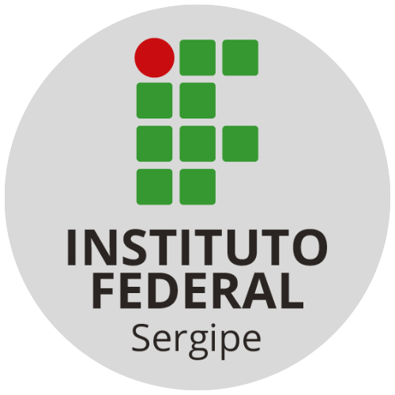

# Aprimoramento da ferramenta Limarka e documentando seu uso efetivo: Facilitando a elaboração de TCCs em Markdown

Este é um trabalho que está sendo desenvolvido e mantido nesse repositório do GitHub. Qualquer contribuição ou sugestão pode ser apresentada e discutida em formato de Issue.

## Resumo

Este trabalho de pesquisa concentra-se na aprimoração da ferramenta Limarka, destinada à elaboração de Trabalhos de Conclusão de Curso (TCCs) em formato Markdown. Além disso, o estudo aborda a criação de documentação abrangente que visa destacar e facilitar o uso efetivo dessa ferramenta. O objetivo principal é melhorar a experiência dos estudantes na elaboração de TCCs, proporcionando uma ferramenta mais eficaz e fornecendo orientações detalhadas por meio da documentação. Ao unir esses esforços de aprimoramento e documentação, busca-se simplificar o processo de criação de TCCs em Markdown, tornando-o mais acessível e eficiente para os acadêmicos.

**Palavras-chave**: Limarka, Markdown, Melhoria, TCCs

## Abstract

This research work focuses on improving the Limarka tool, designed for preparing Course Completion Papers (TCCs) in Markdown format. Furthermore, the study addresses the creation of comprehensive documentation that aims to highlight and facilitate the effective use of this tool. The main objective is to improve students' experience in preparing TCCs, providing a more effective tool and providing detailed guidance through documentation. By combining these improvement and documentation efforts, we seek to simplify the process of creating TCCs in Markdown, making it more accessible and efficient for academics.

**Keywords**: Limarka, Markdown, Improvement, TCCs

## Agradecimentos

Aos professores, pelas correções e ensinamentos que me permitiram apresentar um melhor desempenho no meu processo de formação profissional ao longo do curso.

#### [Ver publicação](https://reinanhs.github.io/limarka-template-tcc/assets/files/titulo-do-trabalho.pdf)

> Este projeto foi escrito utilizando [limarka-template-tcc](https://github.com/ReinanHS/limarka-template-tcc).
> Essa ferramenta é responsável por contém os arquivos do esqueleto (modelo) para iniciar a escrita de um trabalho acadêmico com o limarka. Além disso, este projeto contém várias outras novidades que facilitam a escrita de um trabalho acadêmico.
